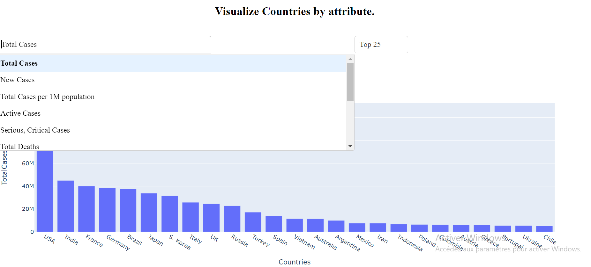
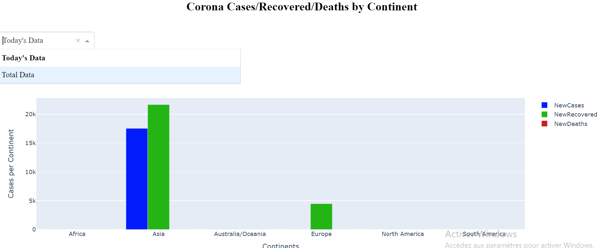
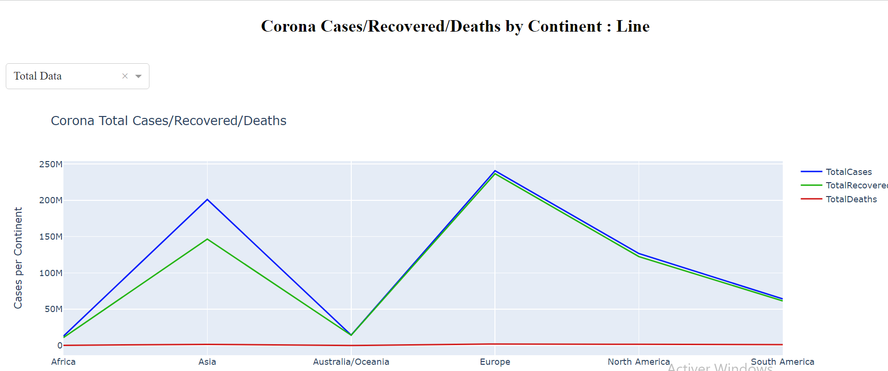
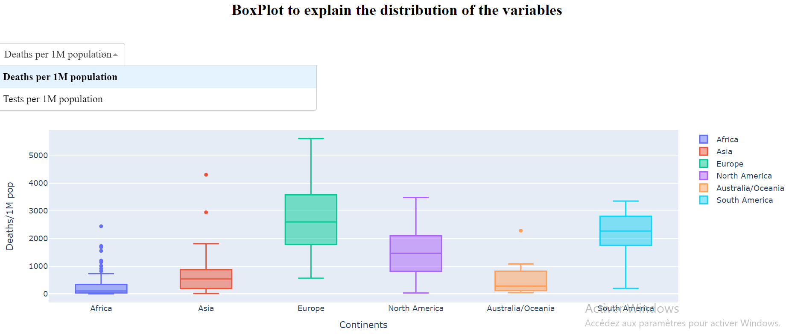
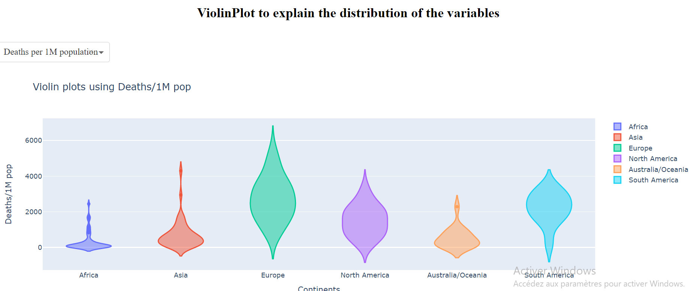
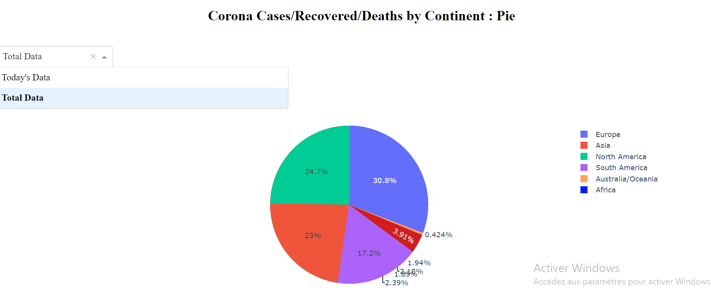

# Corona Tracker Dashboard

This project aims to provide a dashboard for tracking coronavirus cases, recoveries, and deaths worldwide. The data is scraped from the Worldometer website using BeautifulSoup library and displayed using Plotly and Dash.

## Getting Started

### Prerequisites

- Python 3.7 or higher
- BeautifulSoup
- requests
- numpy
- pandas
- plotly
- dash

### Installation

1. Clone the repository:

2. Install the required libraries:

## Usage

1. Run the main script:

2. Open your web browser and go to http://localhost:8050 to access the dashboard.

## Features

- Display coronavirus cases, recoveries, and deaths by continent.

- Visualize countries based on various attributes such as total cases, new cases, total deaths, etc.

- Generate box plots and violin plots to analyze the distribution of variables.

- View pie charts showing the distribution of cases, recoveries, and deaths by continent.

## Contributing
Contributions are welcome! If you would like to contribute to this project, please follow these steps:

1. Fork the repository.
2. Create a new branch for your feature or bug fix.
3. Make your changes and commit them.
4. Push your changes to your fork.
5. Submit a pull request.

## Acknowledgements

- Professor Fahd KALLOUBI
- [BeautifulSoup](https://www.crummy.com/software/BeautifulSoup/bs4/doc/)
- [Plotly](https://plotly.com/)
- [Dash](https://dash.plotly.com/)

